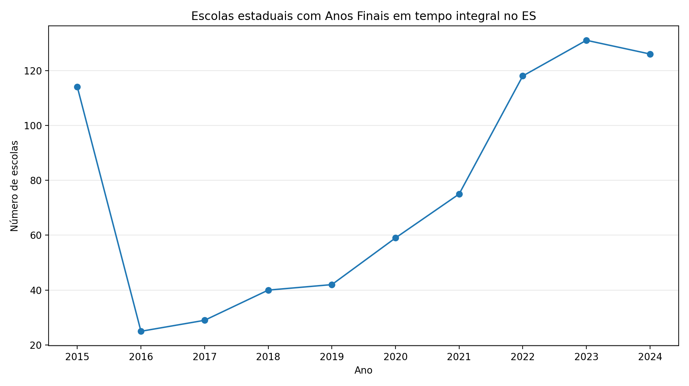
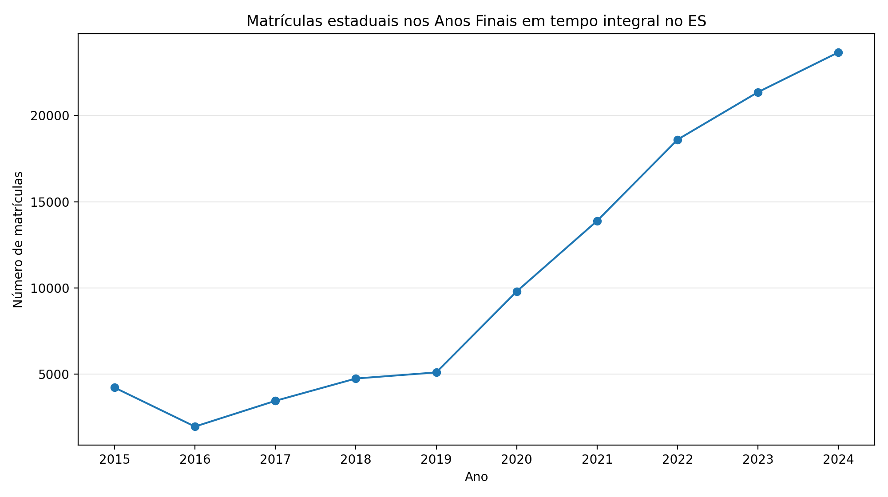
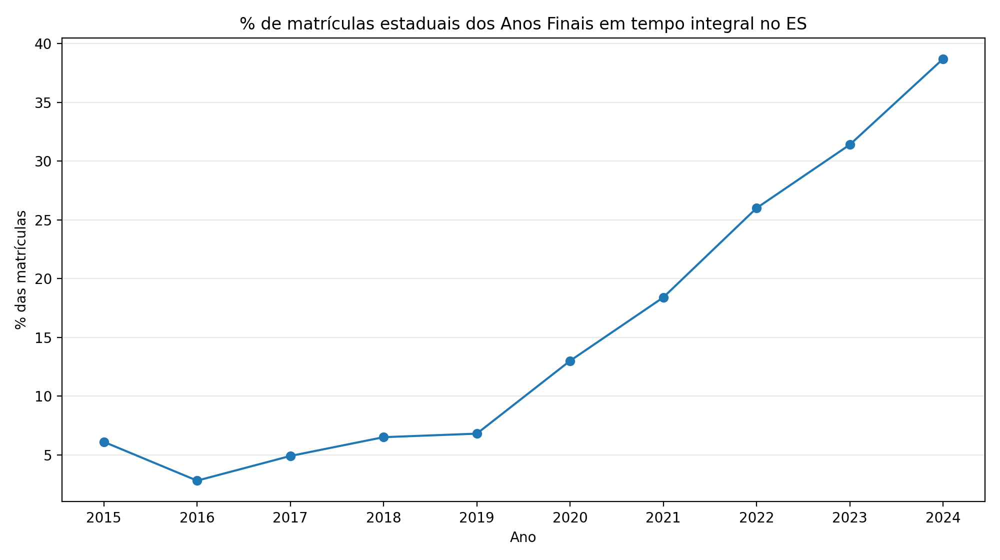

# Resultados — Censo ES Tempo Integral

Tabela gerada a partir dos microdados do Censo Escolar do INEP.

Critério principal: escola no Espírito Santo com `QT_MAT_FUND_AF_INT > 0`, isto é, ao menos uma matrícula em tempo integral nos Anos Finais do Ensino Fundamental.

## Tabela-resumo

|   Ano |   Escolas estaduais com AF |   Escolas estaduais com AF integral | % escolas estaduais AF integral   |   Matrículas estaduais AF |   Matrículas estaduais AF integral | % matrículas estaduais AF integral   |   Escolas municipais AF integral |   Matrículas municipais AF integral |
|------:|---------------------------:|------------------------------------:|:----------------------------------|--------------------------:|-----------------------------------:|:-------------------------------------|---------------------------------:|------------------------------------:|
|  2015 |                        294 |                                 114 | 38,8%                             |                    69.733 |                              4.225 | 6,1%                                 |                              301 |                              18.243 |
|  2016 |                        288 |                                  25 | 8,7%                              |                    69.576 |                              1.963 | 2,8%                                 |                              158 |                               8.964 |
|  2017 |                        289 |                                  29 | 10,0%                             |                    70.357 |                              3.455 | 4,9%                                 |                              163 |                               9.102 |
|  2018 |                        283 |                                  40 | 14,1%                             |                    72.719 |                              4.749 | 6,5%                                 |                              100 |                               4.605 |
|  2019 |                        286 |                                  42 | 14,7%                             |                    75.582 |                              5.103 | 6,8%                                 |                              132 |                               6.608 |
|  2020 |                        292 |                                  59 | 20,2%                             |                    75.121 |                              9.8   | 13,0%                                |                               90 |                               4.592 |
|  2021 |                        293 |                                  75 | 25,6%                             |                    75.559 |                             13.893 | 18,4%                                |                               85 |                               7.471 |
|  2022 |                        288 |                                 118 | 41,0%                             |                    71.509 |                             18.605 | 26,0%                                |                              196 |                              10.786 |
|  2023 |                        282 |                                 131 | 46,5%                             |                    67.993 |                             21.358 | 31,4%                                |                              176 |                              10.459 |
|  2024 |                        265 |                                 126 | 47,5%                             |                    61.106 |                             23.666 | 38,7%                                |                              185 |                              11.631 |

## Arquivos para download

- [CSV completo](tabelas/es_af_tempo_integral_2015_2025.csv)
- [Excel completo](tabelas/es_af_tempo_integral_2015_2025.xlsx)

## Gráficos

### Escolas estaduais com Anos Finais em tempo integral

### Matrículas estaduais nos Anos Finais em tempo integral

### Percentual de matrículas estaduais dos Anos Finais em tempo integral

## Observação metodológica

O Censo Escolar permite reconstruir a evolução observada da oferta declarada de matrículas em tempo integral nos Anos Finais. Para avaliação causal, o ano efetivo de entrada das escolas no programa estadual deve ser validado com registros administrativos da SEDU.
